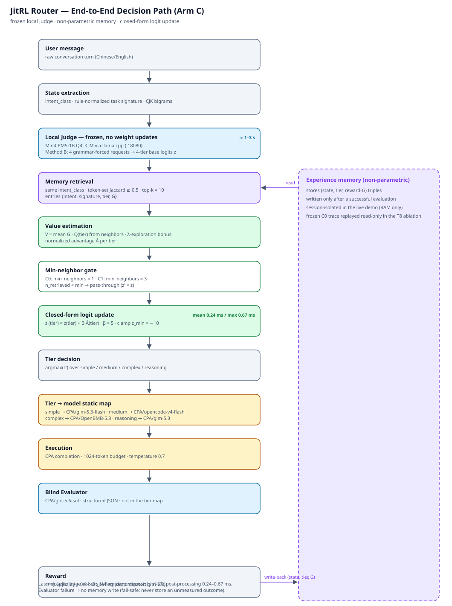
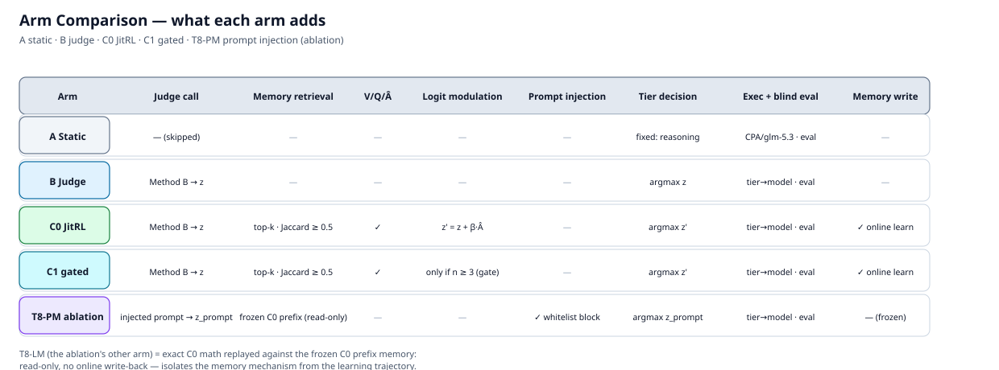
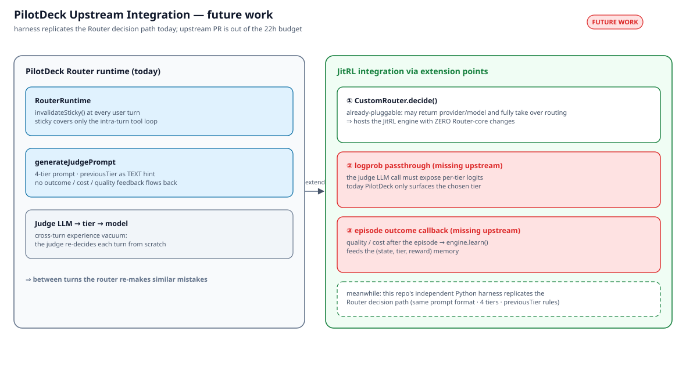

# PilotDeck-Router-JitRL

> **Just-In-Time Reinforcement Learning（JitRL，面向 LLM agent 的无梯度持续学习）× PilotDeck Router 的 TokenSaver Judge**
> 冻结本地 Judge 权重，维护**轨迹级非参数记忆**：完整路由轨迹结束后由轨迹级盲评评估器复盘整条轨迹，逐步信用分配后经 active/provisional/quarantine 生命周期准入写回记忆；在线阶段检索相似历史经验估计 V/Q/优势，再对 Judge 的四档 logit 做闭式更新——填补 Router 的**跨轮经验真空**，让路由器跨轮学习，而不是每轮从零开始、重复犯同样的错误。

```text
z′(tier) = z(tier) + β · Â(tier)              # 在线：对冻结 Judge 的四档 logit 做闭式更新
G_t      = r_t + η·Σ γ^(k−t)·r_k              # 离线：轨迹结束后的逐步信用分配（γ=0.8, η=0.5）
```

本仓库是一个**纯标准库（stdlib-only）的独立 Python harness**：不依赖 PilotDeck 启动链路，但**逐项忠实复刻 Router 的决策路径**（相同的 judge prompt 格式、四档体系、previousTier 续轮规则），在真实执行模型调用（经 PilotDeck provider 配置）与盲评 Evaluator 下完成了 A/B/C0/C1 预注册对照实验与 T8 机制消融；Session 4 将记忆更新回路重写为论文式轨迹级闭环（M1/M2），三臂对照实验 S4-M2 已预注册。目标：保住回答质量的同时降低模型调用成本。

**诚实结论先行**：端到端管线完全可行，JitRL 后处理开销近零（mean 0.2444ms / max 0.6664ms）；但默认 C0 **未达到 ≥20% 的成本目标**（D10 判定 3/4），C1 保守门控也**未通过预注册判据**（3/5，且出现记忆级联），T8 消融显示当前 1B Judge 几乎不利用注入的记忆（0/6 影响）。本项目把「带机理分析的诚实负结果」当作一等公民，全部数字为冻结口径，见[实验](#5-实验)与[诚实结论](#6-诚实结论)。

---

## 目录

1. [TL;DR](#tldr)
2. [动机](#1-动机)
3. [架构](#2-架构)
4. [仓库结构](#3-仓库结构)
5. [快速开始](#4-快速开始)
6. [实验](#5-实验)
7. [诚实结论](#6-诚实结论)
8. [已知限制](#7-已知限制)
9. [Web Demo](#8-web-demo)
10. [PilotDeck 集成（MVP 已完成）](#9-pilotdeck-集成mvp-已完成)
11. [可复现性](#10-可复现性)

---

## TL;DR

任务集：24 条主任务（6 族 × 4 变体）+ 5 条续轮探针；所有组同序执行、单 episode、24/24 完成；质量为 `CPA/gpt-5.6-sol` 盲评（1–5 分）。**n=24，方向性证据，不声称统计显著性。**

| Arm | Mean quality | Exec cost | GT tier accuracy | Verdict |
|---|---:|---:|---:|---|
| **A** Static（全量 `CPA/glm-5.3`） | 2.2083 | $0.088888 | — | 基线 |
| **B** Judge（仅本地 Judge 路由） | 2.6667 | **$0.028333** | 29.17% | 比 A 省 68.1%，但主要来自弱 Judge 偏 simple |
| **C0** JitRL（默认） | **2.7917** | $0.029406 | 29.17% | D10 判定 3/4：成本目标 FAIL（−3.78% vs B） |
| **C1** gated（`min_neighbors=3`） | 2.4167 | $0.033047 | 29.17% | 预注册 3/5：P1/P5 FAIL，记忆级联 |
| **T8-PM**（消融：prompt 注入） | 2.5417 | $0.027993 | —¹ | 方向性占优，但 0/6 注入改变决策 |

¹ T8 为机制消融（两臂重放同一份冻结记忆），GT 准确率不在其预注册判据内。T8-LM：quality 2.5417 / cost $0.032653，见 §5.4。

---

## 1. 动机

PilotDeck Router 的 TokenSaver 用一个本地小模型 Judge 把用户消息分为四档（simple / medium / complex / reasoning），再映射到不同价位的执行模型。精读上游源码（`RouterRuntime.ts`、`AgentLoop.ts`、`classifyAndRoute.ts`、`generateJudgePrompt.ts`，快照见 `PilotDeck-src/`）得到三个结构性事实：

1. **每个用户轮开始都会调用 `invalidateSticky()`**——sticky 只覆盖轮内的工具循环；
2. **轮与轮之间，Judge 从零重新判档**；
3. 唯一的跨轮信号是 prompt 里的 **`previousTier` 文本提示**——历史的质量/成本从不回流。

这是一个**跨轮经验真空**：上一轮学到的教训（这个任务其实不需要 reasoning 档 / 这个便宜档已经够用）全部丢失，路由器每轮都在重新犯同类错误。

JitRL 恰好补上这一块。映射关系：

| JitRL 概念 | 本项目实现 |
|---|---|
| 冻结策略（no gradient updates） | 本地 llama.cpp 部署 MiniCPM5-1B（Q4_K_M GGUF），权重全程不动 |
| 非参数记忆 | `(state, tier, reward)` 条目，跨 episode 累积 |
| 经验检索 | top-k（k=10）签名 Jaccard 检索相似历史 |
| 价值估计 | 邻域均值 V、per-tier 均值 Q、λ 探索乐观项，归一化得优势 Â |
| 策略更新 | 闭式 logit 调制 `z′ = z + β·Â`，clamp(−10) 后 argmax 选档 |

目标：**保质量、降成本、让路由器跨轮学习**，而不是每轮盲判。

## 2. 架构



**两个闭环**（`jitrl_core`）：

```text
在线决策环（每轮，微秒级）          离线学习环（每轨迹结束，一次评估调用）
┌─────────────────────────┐        ┌──────────────────────────────────────┐
│ retrieve（top-k Jaccard）│        │ RouteTrajectory（step=真实路由决策）  │
│ → estimate V/Q/Â         │        │ → TrajectoryLevelEvaluator 盲评复盘   │
│ → gate（C1 可选邻域门控） │   ──▶  │   （episode 评价 + 逐步路由判定）     │
│ → modulate z′=z+β·Â      │ 写回   │ → CreditAssigner 逐步信用分配        │
│ → choose（argmax）        │        │   （identity G=r / discounted）       │
└─────────────────────────┘        │ → MemoryUpdater 生命周期准入          │
                                   │   （active/provisional/quarantine）   │
                                   └──────────────────────────────────────┘
```

- **在线决策环**：检索相似经验、估计 V/Q/Â、（C1）邻域门控、对四档 logit 做闭式调制后 argmax 选档——数学与冻结口径完全一致，JitRL 后处理开销 0.2–0.7ms；
- **离线学习环（Session 4 重写）**：一个可学习 step = 一次真实路由决策（不是 token、不是工具调用）。轨迹结束后，轨迹级评估器**一次调用**输出 episode 评价与每轮 `routing_verdict / local_quality / recommended_tier / failure_tags / confidence`；确定性代码用同一 D3 公式（`0.6·quality + 0.3·cost_saving`）逐轮合成 reward；`DiscountedCreditAssigner`（`G_t = r_t + η·Σγ^(k−t)·r_k`，η<1 防止后步补救洗掉前步误路由）计算逐步回报；`LifecycleMemoryUpdater` 按评估器置信度分流——`≥0.80` active（可检索）、`≥0.60` provisional（保留审计、不参与调制）、否则 quarantine。**失败语义按轨迹**：任一轮执行失败或评估失败 → 整条轨迹零记忆写入。



| 模块 | 内容 |
|---|---|
| `jitrl_core/` | engine（decide + learn_trajectory）、state（intent_class + 规则归一化签名 + CJK bigram）、memory（top-k Jaccard 检索 + `LifecycleMemory` 生命周期 sidecar）、value（V/Q/Â，含 λ 探索）、policy（clamp / modulate / argmax）、**types（`DecisionStep`/`RouteTrajectory`/`StepEvaluation`/`TrajectoryEvaluation`）**、**credit（`IdentityCreditAssigner` / `DiscountedCreditAssigner`）**、**updater（`build_entry` 冻结六键构造 / `DirectMemoryUpdater` / `LifecycleMemoryUpdater`）**、config（冻结超参） |
| `local_judge/` | 面向 llama.cpp 的生产 JudgeClient：**Method B 硬化 logit 提取**（四档各一次 grammar-forced 请求、共 4 次；canonical tokenization 校验 + 重试阶梯 + `Z_MIN=−10` clamp）、GBNF grammar、逐字节复刻 PilotDeck `generateJudgePrompt` |
| `harness/` | `run.py`（routing-only A/B/C）、`run_real.py`（真实 episode A/B/C/C1 + **`--arm T1/T2/T3` 记忆更新臂 + `--tier-map spec/switched` 档位映射**）、**`trajectory.py`（`TrajectoryEvaluator` terminal/per_step 双模式 + 记忆更新适配器）**、**`multiturn.py`（traj_id 分组 + 会话历史构建）**、`run_ablation.py`（T8-LM vs T8-PM）、`cpa_client.py`（运行时读取 PilotDeck 配置中的 OpenAI 兼容 provider 凭据）、`evaluator.py`（盲评结构化评估 + **`TrajectoryLevelEvaluator` 轨迹级复盘**）、`real_rewards.py`、`pricing.py`（spec/switched 双映射 + 计价表） |
| `eval/` | 任务集 `tasks.jsonl`（24+5）、**`multiturn_tasks.jsonl`（8 轨迹 28 轮）**、`tasks-meta.md`、`pricing.json`、分析器与冻结聚合资产（见 §10） |
| `diagrams/` | 4 张技术 SVG：`architecture.svg`、`arms.svg`（本节）、`online-offline.svg`、`pilotdeck-integration.svg` |
| `demo/` | Web Demo（离线优先，见 [§8](#8-web-demo)） |
| `docs/optimization/` | Session 4 优化线正本：`MEMORY-LOOP-DECISIONS.md`（M1/M2 设计冻结）、`SESSION-4-PROGRESS.md`、`S4-M2-PREREGISTRATION.md`（三臂预注册 v1.1） |

**关键工程细节**

- **Method B logit 提取**：llama.cpp 的 GBNF 只掩码采样、`top_logprobs` 返回的是掩码前分布，且 `reasoning` 在该词表是 2 个 token——单请求读不齐四档。生产客户端对四档**各做一次单档 grammar-forced 请求**，取档位名 canonical token 路径的 logprob 之和，附校验/重试/clamp(−10) 阶梯。每次判档 = 4 个本地请求，mean ≈2.3s。
- **b10903 `reasoning_content` 兼容**：llama-server build b10903 会把 grammar-forced 输出路由进 `message.reasoning_content` 而 `content` 为空；客户端同时处理 `content` 与 `reasoning_content`（已文档化的兼容修复，token 路径与 logprob 不变）。
- **延迟分离计量**：Judge 的 4 请求延迟（≈2.3s mean）与 JitRL 后处理延迟（mean 0.2444ms / max 0.6664ms）**分开插桩**，绝不混报。
- **轨迹级评估器的盲评边界（M2）**：评估器可见每轮**路由档位**（判断 under/over-routed 必需）但**不可见**执行模型名、价格与 usage——D8「评估器不评自己」原则保持；steps 数必须等于轮数、turn_index 对位、枚举合法，任一校验失败即整条轨迹零写入。
- **冻结契约零破坏（M1/M2 重写约束）**：memory entry 六键 schema（`intent_class/signature_tokens/tier/G/ts/episode_id`）不变，生命周期与语义反馈（verdict/recommended_tier/failure_tags/feedback/confidence）存 `LifecycleMemory` sidecar；`decide()` 的数值路径与 RNG 位相不变（单步轨迹 + identity 信用与旧 `learn()` 逐位等价，测试锁定）；record schema 仅加法扩展（`traj_id/n_steps/turn_index/n_turns/arm`）。

## 3. 仓库结构

```text
PilotDeck-Router-JitRL/
├── jitrl_core/     # JitRL 引擎：state / memory（含 LifecycleMemory）/ value / policy / engine /
│                   #   types（轨迹契约）/ credit（信用分配）/ updater（记忆更新）/ config（+ tests）
├── local_judge/    # 生产 JudgeClient（Method B）、GBNF grammar、探针（+ tests）
├── harness/        # run / run_real（--arm T1/T2/T3 + --tier-map）/ trajectory / multiturn /
│                   #   run_ablation / cpa_client / evaluator（含 TrajectoryLevelEvaluator）/
│                   #   real_rewards / pricing / separability（+ tests，testdata/）
├── eval/           # tasks.jsonl（24 主任务 + 5 续轮探针）、multiturn_tasks.jsonl（8 轨迹 28 轮）、
│                   #   tasks-meta.md、pricing.json、
│                   #   analyze_results / analyze_c1 / analyze_ablation / run_continuation_probes、
│                   #   冻结聚合：results-summary.json、results-tasks.csv、charts/（5 SVG）、
│                   #   c1/（summary + CSV + 4 SVG）、ablation/（冻结 memory trace + SHA-256 +
│                   #   summary + CSV + 4 SVG）
├── diagrams/       # architecture.svg / arms.svg / online-offline.svg / pilotdeck-integration.svg
├── demo/           # Web Demo（离线优先）
├── integrations/   # PilotDeck 集成 MVP 交付物：patch + overlay + verify.py（见 §9）
├── docs/           # 设计文档 + optimization/（Session 4 记忆回路优化线正本）
├── logs/           # 实验日志（gitignore；正式命名见 §10）
└── PilotDeck-src/  # 上游 PilotDeck 源码快照（决策路径复刻的对照基准）
```

## 4. 快速开始

环境：Python 3.11，**仅标准库**（测试另需 pytest）。

### 4.1 本地 Judge（必需）

llama.cpp `llama-server` 部署 **MiniCPM5-1B Q4_K_M GGUF（约 683MB）**：

- 端点默认 `http://127.0.0.1:18080`，可用环境变量 `JITRL_JUDGE_ENDPOINT` 覆盖；
- 模型 alias `minicpm5-1b`（可用 `JITRL_JUDGE_MODEL` 覆盖）；
- 本地推理的边际 API 成本记 **$0**。

### 4.2 执行/评估模型（真实实验必需）

harness 在**运行时**读取 PilotDeck 配置（默认 `~/.pilotdeck/pilotdeck.yaml`，可用 `--config` 或 `PILOTDECK_CONFIG_PATH` 覆盖）中 provider 条目的 `url` 与 `apiKey`，按 **OpenAI 兼容协议**（`POST {url}/chat/completions`）调用；provider 名默认 `CPA`，可用 `JITRL_PROVIDER_ID` 覆盖。**API key 只在运行时读取，仓库从不存储任何密钥。**

价格单位为 $/Mtok（input / output）：

| 角色 | 模型 | $/Mtok（input / output） |
|---|---|---:|
| simple 档执行 | `CPA/glm-5.3-flash` | 0.15 / 0.50 |
| medium 档执行 | `CPA/opencode-v4-flash` | 0.30 / 1.20 |
| complex 档执行 | `CPA/OpenBMB-5.3` | 1.40 / 4.40 |
| reasoning 档执行 + A 组静态路由 | `CPA/glm-5.3` | 1.40 / 4.40 |
| 盲评 Evaluator（不在档位映射内，杜绝自评） | `CPA/gpt-5.6-sol` | 4.00 / 20.00 |

成本节省的分母（cost_saving denominator）= `CPA/glm-5.3`。价格正本：`eval/pricing.json`。

> **S4-M2 修订 A（`--tier-map switched`）**：因中继上游永久失去 `opencode-v4-flash` 且 5 小时限额耗尽部分凭据池，S4-M2 实验运行改用跨 provider 映射——simple=`provider1/deepseek-v4-flash-vision-exp`、medium=`CPA/tokendance-v4.1-flash`、complex=`CPA/OpenBMB-5.3`（不变）、reasoning=`provider1/glm-5.3`；评估器仍为 `CPA/gpt-5.6-sol`。switched 模型按同档价格类代理计价（已入 `pricing.json`），三臂同表，相对比较有效。默认 `--tier-map spec` 即上表冻结映射。

### 4.3 测试与运行

```bash
# 0) 测试（无需任何服务与 key）——当前 330 passed
python -m pytest harness jitrl_core local_judge eval -q

# 1) routing-only（只跑决策循环，不执行生成；无 llama.cpp 时可改用 --judge mock）
python -m harness.run --mode B --tasks eval/tasks.jsonl --judge llama \
  --out logs/routing_B.jsonl
python -m harness.run --mode C --tasks eval/tasks.jsonl --judge llama \
  --out logs/routing_C.jsonl --memory-out logs/routing_C_memory.jsonl

# 2) 签名可分性检查
python -m harness.separability --tasks eval/tasks.jsonl

# 3) 真实 episode A/B/C0（需要 llama.cpp Judge + PilotDeck 配置中的 provider 凭据）
python -m harness.run_real --mode A --tasks eval/tasks.jsonl --judge llama \
  --out logs/s2_full_A_main24.jsonl
python -m harness.run_real --mode B --tasks eval/tasks.jsonl --judge llama \
  --out logs/s2_full_B_family_order.jsonl
python -m harness.run_real --mode C --tasks eval/tasks.jsonl --judge llama \
  --out logs/s2_full_C_main24_retry2.jsonl \
  --memory-out logs/s2_full_C_main24_retry2_memory.jsonl   # 默认 min_neighbors=1，即 C0

# 4) C1：同一命令加预注册门控参数
python -m harness.run_real --mode C --tasks eval/tasks.jsonl --judge llama \
  --min-neighbors 3 \
  --out logs/s2_full_C1_main24.jsonl --memory-out logs/s2_full_C1_main24_memory.jsonl

# 5) 续轮探针（仅 Judge 路由，不执行生成）
python -m eval.run_continuation_probes

# 6) T8 消融（重放冻结的 C0 prefix 记忆，只读、无在线写回）
python -m harness.run_ablation --arm T8-LM --judge llama --out logs/s3_ablation_T8_LM.jsonl
python -m harness.run_ablation --arm T8-PM --judge llama --out logs/s3_ablation_T8_PM.jsonl

# 7) 聚合分析（从正式日志重算全部聚合与图表；默认路径即正式日志）
python eval/analyze_results.py
python eval/analyze_c1.py
python eval/analyze_ablation.py --lm logs/s3_ablation_T8_LM.jsonl \
  --pm logs/s3_ablation_T8_PM.jsonl --out-dir eval/ablation

# 8) S4-M2 多轮轨迹记忆更新三臂（T1 终局单标量 / T2 逐步+折扣信用 / T3 生命周期准入；
#    任务行共享 traj_id 成轨迹，无 traj_id 行退化为单轮；判据见 docs/optimization/S4-M2-PREREGISTRATION.md）
python -m harness.run_real --mode C --arm T1 --tasks eval/multiturn_tasks.jsonl \
  --judge llama --episodes 2 --tier-map switched \
  --out logs/s4m2_T1.jsonl --memory-out logs/s4m2_T1_mem.jsonl
python -m harness.run_real --mode C --arm T2 --tasks eval/multiturn_tasks.jsonl \
  --judge llama --episodes 2 --tier-map switched \
  --out logs/s4m2_T2.jsonl --memory-out logs/s4m2_T2_mem.jsonl
python -m harness.run_real --mode C --arm T3 --tasks eval/multiturn_tasks.jsonl \
  --judge llama --episodes 2 --tier-map switched \
  --out logs/s4m2_T3.jsonl --memory-out logs/s4m2_T3_mem.jsonl
```

冻结超参（正式实验全程一致）：

```text
k=10, β=5, λ=0.05, α=5, jaccard_threshold=0.5, z_min=−10, seed=42,
min_neighbors=1（C0）/ 3（C1，预注册）,
max_tokens_exec=1024, temperature_exec=0.7,
Evaluator: temperature=0.2, max_tokens=300
S4-M2 记忆更新臂: γ=0.8, η=0.5（折扣信用）; 生命周期准入 0.80/0.60
```

## 5. 实验

### 5.1 实验设置与公平性

- **任务集**：24 条主任务 = 6 族 × 4 变体（`chat_qa` / `code_gen` / `doc_writing` / `data_analysis` / `refactor` / `info_retrieval`），另有 5 条续轮探针，共 29 条（`eval/tasks.jsonl`）；
- **顺序**：冻结的 family-blocked 顺序 `T01, T05, T09, …, T24`；所有组同序执行，单 episode per task；
- **完成度**：A/B/C0 各 24/24，C1 24/24，T8 两臂各 24/24；
- **质量口径**：`CPA/gpt-5.6-sol` 盲评（1–5 分，temperature 0.2，max_tokens 300）；Evaluator 为测量开销，单列、不计入路由成本；
- **证据强度**：n=24、单次运行，全部结论为方向性证据，不声称统计显著性。

### 5.2 A/B/C0 与 D10 判定

| Metric | A Static | B Judge | C0 JitRL |
|---|---:|---:|---:|
| Mean quality（盲评 1–5） | 2.2083 | 2.6667 | **2.7917** |
| Exec cost | $0.088888 | **$0.028333** | $0.029406 |
| Cost saving vs A | — | 68.1% | 66.9% |
| GT tier accuracy | — | 29.17% | 29.17% |
| Misgrade rate | — | 70.83% | 70.83% |
| 记忆改变决策（flips） | — | 0 | 2 |
| JitRL 后处理延迟 | — | — | mean 0.2444ms / max 0.6664ms |

判读：

- **B/C0 vs A 的节省主要来自弱 Judge 大量选 simple**，而不是跨轮学习；
- **C0 vs B**：质量 +0.125，但**不可归因于调制**——2 条 flip 任务的净质量变化为 0，增益来自 Judge base-choice 漂移 + temperature 0.7 重采样；成本 **−3.78%**（即 C0 比 B 贵 3.78%）；
- **C0 的 2 条 flip（T06、T19）均为有害 flip**：小邻域 λ-exploration 把 simple 推到 complex，合计 +$0.008239，质量增益为零；
- **延迟分离**：Judge（Method B，4 个 llama.cpp 请求）≈2.3s mean；JitRL 后处理 mean 0.2444ms / max 0.6664ms。

**D10 判定（预注册，总判定 3/4）**：

| Criterion | Threshold | Result | Verdict |
|---|---|---|---|
| Cost saving vs B | ≥20% | −3.78% | **FAIL** |
| Quality vs B | ≥ −0.3 | +0.125 | PASS |
| Misgrade vs B | ≤ B + 5pp | 0pp | PASS |
| JitRL latency | ≤500ms | 0.6664ms（max） | PASS |

### 5.3 C1：保守门控与记忆级联

预注册的邻域门控（`min_neighbors=3`：检索邻居数不足则不调制，直接用 base logits）：

| Metric | C1 gated |
|---|---:|
| Mean quality | 2.4167 |
| Exec cost | $0.033047（**+16.64% vs B**） |
| Misgrade rate | 70.83% |
| Flips | 1 |
| 门控统计 | gated 22 / modulated 2（T08、T20，均 n=3） |

**P1–P5 预注册判据：3/5 NOT PASSING**

| Criterion | Result | Verdict |
|---|---|---|
| P1 exec cost ≤ B + $0.001 | +16.64% | **FAIL** |
| P2 quality | −0.25 | PASS |
| P3 misgrade | 0pp | PASS |
| P4 JitRL latency | max 0.4845ms | PASS |
| P5 flip 无害 | 有害级联 | **FAIL** |

按预注册停止条件**停止，未做进一步的 gate 阈值扫描**。

**诚实的机理解读**：门控确实抑制了 C0 的 T06/T19 flip，**但被 gate 的决策仍按 base tier 写回记忆**，改变了后续的 Q/——记忆级联在 T20 制造了**新的** flip（simple→complex，+$0.004190，质量 1→1，约为 B 组 simple 档成本的 8.8 倍）。问题被**移动**（T06/T19 → T20），没有被解决。

### 5.4 T8 消融：logit 调制 vs prompt 注入

设置：**冻结 C0 prefix 记忆重放**（第 i 个任务只读先前记忆，杜绝自身/未来 outcome 泄漏），只读、无在线写回；两臂各 24/24，唯一差异是记忆的作用机制。

| | T8-LM（logit 调制） | T8-PM（prompt 注入） |
|---|---|---|
| 机制 | 精确复现 C0 数学（`z′ = z + β·Â`） | 白名单记忆块注入 Judge prompt，无调制 |
| Mean quality | 2.5417 | 2.5417 |
| Exec cost | $0.032653 | **$0.027993** |
| 改变原始 Judge 选择 | 1（T19：simple→complex，+$0.004194，质量 1→1） | 0（注入 6 个记忆块，0 次影响） |
| Judge 调用次数 | 24 | 48² |

两臂 tier agreement 23/24，唯一分歧 T19。预注册假设判定：H1 满足（≥1 种机制产生影响）、H2 满足（Δquality 0.0 ≥ −0.3）、H4 满足（LM max jitrl 0.4434ms）。

² PM 每任务多出的 raw-prompt 调用仅用于审计；部署成本 = 1 次决策调用（≈1051.5ms mean）。

**预注册结论：方向性证据偏向 prompt injection——但必须附带强制 caveat**：PM 更便宜是因为它**什么都没改变**（0/6 影响），而 LM 的单次有害 T19 flip 主导了 $0.004660 的成本差；PM 并**未**在 1B Judge 上展示出可用的记忆推理能力。

### 5.5 续轮探针：0/5

5 条 continuation probes 全部失败（**0/5**）：`previousTier` 确实传入 prompt 并提高了其相对 logit，但 MiniCPM5-1B 的 simple 偏置每次都压过它——这是**可复现的 Judge 能力限制，不是管线 bug**。

## 6. 诚实结论

**实现了什么**：端到端证明了「冻结 Judge + 非参数记忆 + 闭式 logit 更新」的完整可行，JitRL 后处理开销近零（0.2–0.7ms），工程资产（harness、分析器、冻结数据、330 项测试）完全可复现。Session 4 进一步把记忆更新回路重写为**轨迹级**（轨迹复盘 → 逐步信用分配 → 生命周期准入，M1/M2 完成、既有行为逐位等价，见 `docs/optimization/`）。

**没实现什么**：

- 默认 C0 **未达到 ≥20% 的成本目标**（D10 判定 3/4；相对 B 反而贵 3.78%）；
- C1 保守门控**也未通过自己的预注册判据**（3/5；门控把有害 flip 级联到了新任务 T20）；
- T8 消融显示当前 1B Judge 几乎不利用注入的记忆（0/6 影响）。

**贡献定位**（按我们认为的价值排序）：

1. **忠实复刻 Router 决策路径的独立 harness**——相同的 judge prompt、四档体系、previousTier 续轮规则，可在不改动 PilotDeck 的前提下做路由实验；
2. **预注册实验纪律**——C1 与 T8 先冻结判据后运行，触发停止条件即停，不在同一数据上继续调参；
3. **带机理分析的诚实负结果**——小邻域探索 bonus 的有害 flip、门控下的记忆级联，都是逐任务数据可复核的失效模式，而非笼统的「效果不好」；
4. **完全可复现的资产集**——冻结任务集、冻结记忆 trace（含 SHA-256）、逐任务 CSV、图表与分析器。

## 7. 已知限制

1. **1024-token 固定执行预算**：大量 `finish_reason=length` 与空响应（每臂 15–16 条 length、14 条空回复），压低绝对质量但保持组间公平；
2. **MiniCPM5-1B 强 simple 偏置**：B/C0 GT 档位准确率仅 29.17%，续轮探针 0/5——弱基策略封顶了任何调制机制的收益空间；
3. **检索只在 similarity=1.0 命中**：规则签名的离散坍缩——同族变体完全归一化后相同才命中，0.4–0.9 相似度区间无泛化带；
4. **执行 temperature 0.7**：同 tier/模型的质量与用量波动无法归因于算法；
5. **llama Judge 跨运行漂移**：base-choice 漂移（S2 中出现过 T13/T22；T8 运行 0 次 base-choice 不一致，但数值 logit 仍有漂移）；
6. **LLM-as-judge Evaluator 自身漂移风险**；
7. **family-blocked 顺序**把「前半 vs 后半」的学习曲线与任务难度混叠；
8. **n=24、单次运行**：全部结论仅为方向性证据，无统计显著性。

## 8. Web Demo

`demo/` 是**离线优先**的 Web Demo（在线/离线双模式路径见 `diagrams/online-offline.svg`）：

1. **实验数据面板（离线，零网络可用）**：直接读取 `eval/` 冻结聚合——A/B/C0/C1/T8 的质量、成本、误档、截断、延迟；C0 的两条有害 flip；C1 门控计数与 T20 级联；续轮探针 0/5；网络/网关故障重试审计。断网可完整演示。
2. **可选的实时决策面板（清晰标记 ONLINE）**：预设任务 + 自由输入，可切换 arm，展示完整决策 trace——base logits → 检索到的记忆 → V/Q/Â → 调制后 logits、gate 原因、所选 tier、执行模型、记忆条数、累计成本、会话重置。失败时优雅降级，不白屏。
3. **隐私**：记忆按会话内存隔离、不持久化观众输入文本；API key 永不发送到浏览器（由后端代理调用）。

运行（stdlib 后端，无需安装任何依赖；离线为默认模式，断网可完整演示数据面板）：

```bash
python -m demo.server                 # 离线模式（默认）→ http://127.0.0.1:8300
python -m demo.server --online        # 启用在线决策面板（需本地 llama.cpp Judge + PilotDeck 配置中的 provider 凭据）
python -m pytest demo -q              # Demo 自身 32 项测试（无需任何服务与 key）
```

## 9. PilotDeck 集成（MVP 已完成）



**状态更新**：第一阶段可运行 MVP 已完成并通过验证，不再停留在 future work。集成严格走上游官方扩展点 `PilotDeckCustomRouter` / `RouterContribution`，不改 Router 内核决策链路；交付物以 patch + overlay 双形式落盘于 [`integrations/pilotdeck-jitrl/`](integrations/pilotdeck-jitrl/)，基线为上游 PilotDeck `v2026.09.10`（commit `cfc4d17`），细节见 [`INTEGRATION.md`](integrations/pilotdeck-jitrl/INTEGRATION.md)。

### 9.1 旧版分析的兑现情况

| 旧版 §9 的分析 | MVP 落地情况 |
|---|---|
| CustomRouter 是上游已存在的扩展点，JitRL engine 可承载其上，无需改内核 | builtin `jitrl` 插件（`plugin.json` + `RouterContribution`）；配置 `router.customRouter.extensionId: jitrl` 即接管路由，零内核改动 |
| 缺口① logprob 透传：Judge 的 logprob 不暴露给路由层 | canonical 协议暂无 logprobs → MVP 采用 4 次并行每档打分请求（0–10 分 → `logit((s+0.5)/11)`）作为 Method B 的保守等价；任一档失败/未配置则回退到确定性启发式 Judge（`mock_judge` 的 TS 移植），始终返回完整四档数值 |
| 缺口② episode outcome 回调：质量/成本不回流路由层 | 新增可选 `PilotDeckCustomRouter.onTurnOutcome` 钩子；`RouterRuntime` 在 custom 路由的执行成功/最终失败路径回传 session/turn/用户消息/决策/usage/响应文本/错误 |

### 9.2 实现要点

- **TS 原生移植 `jitrl_core`**（`src/router/jitrl/`，10 个模块）：四档体系、intent 规则 + 规则归一化签名（CJK bigram）、top-k Jaccard 记忆、V/Q/Â 估计、闭式调制 `z′ = z + β·Â`、`minNeighbors` 门控、确定性 tie-break、`(state, tier, reward)` episode 写回。任务签名与 Python 参考实现逐 token 差分 **21/21 一致**；
- **在线学习闭环**：成功轮由配置的 evaluator 模型直连 `ModelRuntime.complete` 评审（不经过 Router，无递归），reward = `0.6·quality + 0.3·costSaving`（costSaving 按候选集中最贵模型归一化并 clamp 到 [0,1]）；**evaluator 失败或执行失败不写记忆**；
- **记忆持久化**：`<pilotHome>/router/jitrl-memory.json`，原子写（tmp + rename）+ 500ms 节流，容量 5000 drop-oldest；按 memory path 共享进程级状态——`lookupRouter()` 每次新建实例也不会丢学习状态；
- **配置扩展**（`router.customRouter.*`）：`judge` / `evaluator` / `tiers`（档位 → 候选模型）/ `hyperparams`（k、β、λ、α、jaccardThreshold、zMin、memoryCap、seed、minNeighbors）/ `memoryPath` / `judgeTimeoutMs` / `evalTimeoutMs`；旧的仅 `{ extensionId }` 配置保持兼容；
- **配套修复**：`PluginRuntime.refreshWithReport()` 磁盘重载 builtin 插件后不再丢失程序化 `RouterContribution`（否则插件刷新后自定义路由会静默失效）。

配置示例（provider/model 须已存在于目标模型配置）：

```yaml
router:
  enabled: true
  customRouter:
    extensionId: jitrl
    judge: CPA/minicpm5-1b       # 四档打分模型；未配置则回退确定性启发式 Judge
    evaluator: CPA/gpt-5.6-sol   # 质量评审模型；缺省回落 judge
    tiers:                       # 档位 → 候选执行模型
      simple: CPA/glm-5.3-flash
      medium: CPA/opencode-v4-flash
      complex: CPA/OpenBMB-5.3
      reasoning: CPA/glm-5.3
    hyperparams: { k: 10, beta: 5.0, lam: 0.05, alpha: 5.0, jaccardThreshold: 0.5,
                   zMin: -10.0, memoryCap: 5000, seed: 42, minNeighbors: 3 }
    judgeTimeoutMs: 15000
    evalTimeoutMs: 15000
```

### 9.3 应用、校验与验证结果

```bash
git apply integrations/pilotdeck-jitrl/pilotdeck-jitrl.patch    # 在上游 v2026.09.10 检出上应用
python integrations/pilotdeck-jitrl/verify.py PilotDeck-src     # 校验 overlay 与本地检出逐文件一致
```

- TypeScript 类型检查（`tsc -p tsconfig.json`）：通过；
- JitRL node:test 套件：**59 passed / 0 failed**（覆盖核心算法等价、记忆持久化、配置解析、插件注册与刷新保留、outcome 学习 / evaluator 失败不学习 / 执行失败不学习）；
- 根仓库 Python 侧 264 项测试不受影响（研究代码零改动）；
- patch SHA-256：`139aa4fe4dfd9a06e3dab9b3045679cde5dcf0a00e39285e1ccbd974e3c5a720`。

### 9.4 已知限制与后续工作

1. TS 默认 RNG 为 seeded mulberry32（Python 为 MT19937），探索分支不逐位一致；测试注入 rng 保证数值等价；
2. 每次判档 = 4 个并行打分请求（judge 延迟/成本高于单请求）；每个成功轮额外 1 次 evaluator 调用；
3. 执行失败的轮不写记忆（无可靠质量信号）；
4. 上游快照缺 `scripts/check-node-runtime.mjs`，标准 `npm test` 停在既有 prebuild；已直接运行等价的 build + test 主体；
5. 上游 `.gitignore` 忽略 `*.test.ts`——集成测试随本仓库以 overlay/patch 形式分发，不受影响；
6. **在线学习效果尚未做对照评估**：§5 的 A/B/C0/C1 结论均来自 Python harness；真实 PilotDeck 部署下的学习效果须按 §10 的预注册纪律单独设计实验；
7. canonical 协议暴露 logprobs 后，可把打分式 Judge 换回真正的 Method B 单请求路径。

## 10. 可复现性

**正式数据（唯一口径）**：

| Experiment | Logs（`logs/`，gitignore） | Aggregates（随仓库分发） |
|---|---|---|
| A / B / C0 | `s2_full_A_main24.jsonl`、`s2_full_B_family_order.jsonl`、`s2_full_C_main24_retry2.jsonl`（C0 另有 `_memory`） | `eval/results-summary.json`、`eval/results-tasks.csv`、`eval/charts/`（5 SVG） |
| C1 | `s2_full_C1_main24.jsonl`（+ `_memory`） | `eval/c1/`（summary + CSV + 4 SVG） |
| T8 消融 | `s3_ablation_T8_LM.jsonl`、`s3_ablation_T8_PM.jsonl` | `eval/ablation/`（冻结 `frozen-c0-memory-trace.jsonl` + SHA-256 sidecar + summary + CSV + 4 SVG） |
| 续轮探针 | `s2_continuation_probes.jsonl` | `s2_continuation_probes_summary.json` |

- **分析器可从日志重算全部聚合与图表**（默认路径即上表正式日志；`analyze_results.py` 另含 audit-only 输入默认值）；
- **冻结资产**：任务集、定价表、聚合 JSON/CSV/SVG、冻结记忆 trace（含 SHA-256 校验）全部随仓库分发；
- **S4-M2（进行中）**：三臂预注册（`docs/optimization/S4-M2-PREREGISTRATION.md` v1.1，含 switched 映射修订）已冻结；第一次真实运行因 provider 5h 限额中止（零成本），换映射冒烟通过后按预注册继续——结果文档 `S4-M2-RESULTS.md` 将在运行完成后落盘，不回写预注册；
- **测试**：`python -m pytest harness jitrl_core local_judge eval -q` → **330 passed**（无需任何服务与 key；Demo 另有 `python -m pytest demo -q` → 32 passed）；
- **预注册纪律**：C1 与 T8 的判据在运行前冻结，触发停止条件即停；后续方案须另立预注册，不覆盖、不回写。
